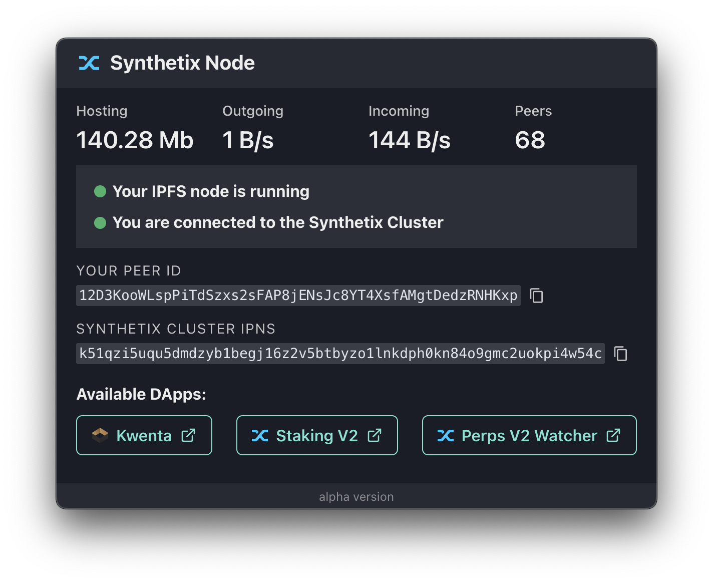

# Synthetix Node



The Synthetix ecosystem has been progressively moving towards reliance on ENS/IPFS over DNS/HTTP for web hosting. For example, Kwenta is available via [eth.limo](http://eth.limo) at [kwenta.eth.limo](https://kwenta.eth.limo/), and you can access it directly in [Brave](https://brave.com/) at [kwenta.eth](http://kwenta.eth/). Synthetix’s Core Contributors are also using IPFS to store and share protocol deployment data using [Cannon](https://usecannon.com).

The Synthetix ecosystem has created an [IPFS Cluster](https://ipfscluster.io/) to coordinate pinning these files.

You can support greater decentralization, reliability, performance, and censorship-resistance by running an IPFS node that follows the cluster. When using a pinned front-end, it will also load faster (as you’ll have the latest version available locally).

Anyone with a computer and an internet connection can join the swarm. It’s fine if you don’t have 100% uptime.

_If you are involved in the Synthetix ecosystem and interested in pinning web apps (or any other data) in the cluster, start a discussion in the #dev-portal channel in the [Synthetix Discord server](https://discord.com/invite/AEdUHzt). Also, check out the [ipfs-deploy repository](https://github.com/Synthetixio/ipfs-deploy)._

## Running the Node

Download the macOS app from [Releases page](https://github.com/Synthetixio/snx-node/releases). (Windows and Linux versions are in development.)

**You will need to Command-click the app and select "Open" from the context menu to run the app. If you are concerned with security, clone this repository, review the implementation, and use the instructions below to start a development build.**

If you would rather run this in a Docker container or run scripts manually, check out the [ipfs-follower repository](https://github.com/Synthetixio/ipfs-follower).

## Development

## Get Started

```sh
npm i
npm start
```

### Generate Electron app icons from svg
```sh
node ./assets/gen-icons.js ./assets/icon.svg ./assets/icons
```

### Generate icns file (for MacOS) from svg
```sh
cd assets
node gen-set.js icon.svg icon.iconset
iconutil -c icns icon.iconset
rm -r icon.iconset
```

### Generate png and ico files (for Linux and Windows) from svg
```sh
node ./assets/gen-ico.js ./assets/icon.svg

cd assets
iconutil -c icns icon.iconset
```
